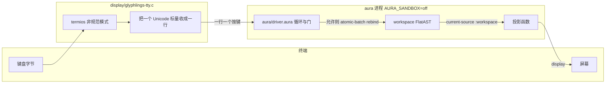
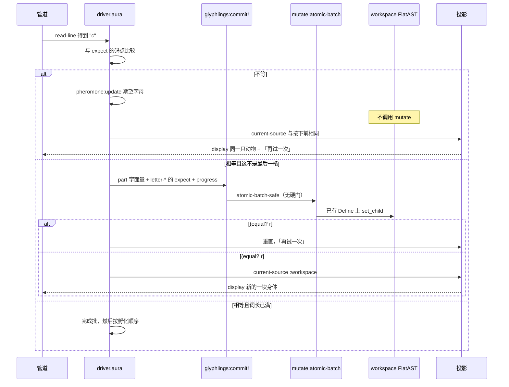
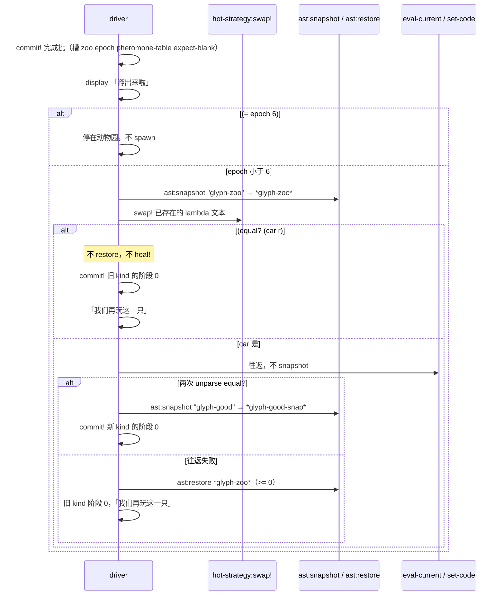

# glyphlings（字母小兽）设计

| 字段 | 值 |
|------|-----|
| 文档 | glyphlings 设计说明（只设计，不落地代码，不建仓库） |
| 作者 | design-doc-writer |
| 日期 | 2026-10-03 |
| 状态 | Draft |
| 产品仓库（计划路径，本文不创建） | `/home/dev/code/grok-dev/glyphlings` |
| 远程（计划，本文不创建） | `https://github.com/cybrid-systems/glyphlings` |
| 只读依赖 | Aura 检出 `/home/dev/code/grok-dev/aura-grok` |
| 对照物（禁止克隆） | `/home/dev/code/grok-dev/aura-typeplay` |

本文面向已经读过 Aura 工作区与 mutate 路径的工程师。标识符、原语名、路径保持英文。给孩子看的句子在文中用中文写出，打的字是英文字母。

---

## Overview

glyphlings 是给大约 6–7 岁孩子的离线打字游戏。一轮大约 6 次孵化，或 8 分钟，先到为止。孩子每次按下**正确的**一个字母，动物就长出一块身体。字打完，这只动物进入动物园。下一只是什么、用「一个大字母」还是「一个 3 字母单词」，由程序根据打错过的字母，热替换工作区里名为 `next-spawn` 的定义。替换如果不能往返或不能 `eval-current`，就回到上一份好的 `ast:snapshot`。孩子看到的是上一波动物，不是崩溃。

可玩的对象**就是**正在跑的 Aura 工作区 FlatAST（`workspace_flat_` + `workspace_pool_`）。画面上的蛋、emoji、巨大字母、动物园，是 `(current-source :workspace)` 的纯投影。没有第二份场景表。宿主侧最多有一个 C 字节管道：把终端的一个按键变成一行，再把 Aura 的 stdout 原样贴回终端。管道里没有单词、没有分、没有场景。

这不是 aura-typeplay。typeplay 的循环、关卡和画面在 Python Textual 里，Aura 只改 `scene-id` / `hue` / `energy`，DeepSeek 写文案。glyphlings 不走那条路。

---

## Background & Motivation

### 现在的 Aura 实际能做什么

下列都是在 `/home/dev/code/grok-dev/aura-grok` 里读到的，不是愿望。

**工作区才是程序正文。** `docs/stdlib/workspace-source-ssot.md`：成功的 `set-code` / `load` / `ast:restore`，以及 `MutationBoundaryGuard` 下的结构性 mutate 之后，活的 `workspace_flat_` 是工作区程序文本的唯一来源。`(current-source :workspace)` 走 live unparse，不读一份可能过期的 `workspace_source_text_`。`docs/stdlib/current-source-roundtrip.md` 的契约是：对 unparse 结果再 `set-code`，第二次 unparse 稳定；优先「重解析成功 + 语义等价」，不要求 pretty-print 字节相同。

**`ast:snapshot` 拍的是工作区，不是脚本顶层 define。** `src/compiler/evaluator_primitives_ast.cpp` 写明：没有 `set-code` / `mutate:*` 建出的非空 `workspace_flat_` 时，`(ast:snapshot)` 返回 `-1`，原因用 `(ast:snapshot-fail-reason)` 读（`:guard-reject` / `:no-workspace` / `:empty-source`）。只在文件顶层写 `(define …)` **不会**进入工作区。所以动物必须 `set-code` 进工作区，不能只写在 `driver.aura` 的顶层。

快照是 FlatAST + StringPool 的深拷贝，另存当时的 unparse 字符串。`(ast:restore id)` 优先整棵拷回去（不重解析）；深拷贝被丢掉时才退回 `set-code`。深拷贝上限是 `Evaluator::kMaxAstSnapshotDeepFlats = 32`（`src/compiler/evaluator.ixx`）。超限时丢掉最老的深拷贝，**id 不重排**，源字符串还在。

**`mutate:rebind` 是按名字换定义体，并且先过能力检查。** `src/compiler/evaluator_primitives_mutate.cpp` 的 `add_mutate` 在函数体之前调用 `require_effect(Mutate)`（名字参数不是 NodeId，走 2 参形式）。拒绝时返回错误对象，**不写**工作区。通过之后 `MutationBoundaryGuard::try_acquire` 包住解析、`set_child`、类型检查、所有权检查和 `finish_mutate_hard_gate`。解析失败会 `free_orphan_nodes_from`（#2791）并 `ok = false`。硬门失败同样 `ok = false`，Guard 析构按 mutation log 回滚。成功时返回精确的 `#t`（#4275：拒绝值可能是真值错误对象，不能把「非 `#f`」当成成功）。成功路径里还会 `eval_flat` 这个 Define，刷新 `top_env` 里的 cell；但注释写明 env 刷新失败**不会**把已经通过硬门的 rebind 改成失败。因此 **env 里的值可以落后于 FlatAST**。画面必须读 `(current-source :workspace)`，不能读变量。

**`mutate:atomic-batch` 把多笔 `mutate:rebind` 做成强原子。** 同一文件里的 `kAtomicBatchLocklessOps` 包含 `"mutate:rebind"`。任一子操作失败则 `rollback_since`。`lib/std/mutate.aura` 的 `mutate:atomic-batch-safe` 在 `mutate:boundary-safe?` 不为真时直接 `#f`，不进入批处理。整批成功是精确 `#t`；失败是真值错误对象，所以只认 `(equal? r #t)`。

**接受路径走的不是上面那段独立原语。** `glyphlings:commit!` 调用 `mutate:atomic-batch-safe`。无锁子操作是 `Evaluator::eval_flat_apply_mutate_rebind`（`src/compiler/evaluator_eval_flat.cpp`）。没有同名 Define 时它拒绝，并写明 new-binding path 尚未支持，必须改用独立 `mutate:rebind`。因此种子里每一个会被 rebind 的名字都要事先存在，批处理不能临场 `define`。它用 `add_mutation_with_rollback` 记下的 operator 是 `"batch-rebind"`，类型串是 `"Define:<name>"`，接着 `set_child` 再记一条 `"structural-set-child"`（`evaluator_primitives_mutate.cpp` 里 `set_child` 的注释）。这条路径会 `eval_flat` 被改的那个 Define 来刷新 `top_env`，刷新失败不把本笔判失败；它返回 mutation id 整数，**不**做事后类型检查、所有权扫描和 `finish_mutate_hard_gate`。硬门只在独立 `mutate:rebind` 上，也就是 `hot-strategy:swap!` 那一次。不要把硬门的开销算进每一个正确键。

**热策略。** `lib/std/hot-strategy.aura`：

- `hot-strategy:register!` 只记下名字、体字符串和一份 `ast:snapshot`，不 rebind。
- `hot-strategy:swap!` 先 `ast:snapshot`，再 `mutate:rebind`，再 `eval-current`。只有 rebind 的返回值 **`equal?` `#t`** 且 `eval-current` 没抛错，才把 last-good 更新。
- **成功时写入的 last-good 快照是 swap 之前的那张**（`hot-strategy.aura` 里 `*hs-last-good-snap*` 被设为 `pre`）。`hot-strategy:heal!` 优先 `ast:restore` 这张旧快照。所以 heal 会撤掉上一次**已经成功**的 swap，而不是停在「上一份好身体」。last-good **体字符串**才是新体；restore 成功时根本走不到用体字符串再 rebind 的分支。
- 因此 glyphlings **不把 `hot-strategy:heal!` 当作主恢复**。主恢复是我们自己在「确认好」之后拍的快照。`heal!` 只在这张快照 `ast:restore` 也失败时才试。这是对提示里那句「失败就 `hot-strategy:heal!`」的修正：原语在，语义和提示的「上一份好状态」差一拍。照抄会把动物园退回两步。

**信息素。** `lib/std/ant.aura` 的表是进程内 `*pheromone-table*`，不是 FlatAST。`pheromone:update` 的公式是 `current * 0.95 + delta`（缺键时 `pheromone:score` 先当 `0.1`）。没有「设成绝对值」的原语。`pheromone:init` 会把表**换成** `edsl-lit-tweak` 那一组变异算子，调用它会毁掉字母键。`pheromone:rank` 按分数插入排序。`pheromone:evaporate!` 把所有键乘 rho。

**进化模块不能用。** `lib/std/evolve.aura` 的 `evolve-strategy` 读取 `intend-analytics`，把英文句子 `string-append` 进策略体。那是在合成自由文本，不是封闭动物表。`agent:tick`（`register_auto_evolve_primitives`）是覆盖率缺口的自进化循环，沙箱下要 `self-evo`。两者都不是本游戏。

**标准 I/O 没有原始终端模式。** `(read-line)` 与 `(read)` 都是 `std::getline`（`evaluator_primitives_char.cpp`、`evaluator_primitives_file.cpp`）。全库没有 `read-char` / `termios` / `tcsetattr` 原语。`src/linenoise/` 是 REPL 行编辑，不是游戏能调用的原语；入口是 `aura aura/driver.aura` 时，循环走的是 `read-line`。`(display x)` 把字符串写到 stdout 并 `fflush`（`evaluator_primitives_runtime.cpp`）；嵌入的 NUL 被跳过。`(newline)` 存在。`(monotonic-ms)` / `(current-time-ms)` 存在（`lib/std/datetime.aura` 包装的原语，注册在 `evaluator_primitives_misc.cpp`）。没有找到 `beep` / `audio` / `play-sound` 原语（在 `src/compiler` 的原语注册里搜过这些名字）。声音不做。

**能力系统在默认生产配置下会拒绝一次「刚启动就 rebind」。** `src/main.cpp`：`AURA_SANDBOX` 默认 Restricted，`AURA_SANDBOX=off` 才是 CLI 自己写的 “local Soft ergonomics”。`Evaluator::require_effect`（`evaluator_security.cpp`，#4241）在 production hard face 上如果 `peek_audit_mutation_id(0) == 0`，**直接返回 false**，不写工作区、不发副作用。进程刚起来没有 mutation session。另外 Restricted 且 sandbox 活跃时，`check_and_record_effect` 要求租户**持有** `Effect::Mutate` 位（`capability_model.hh` 的 `need_grant`）。高风险授予在生产默认下是 single-use 且 session-bound；`mutation_id == 0` 的授予会被拒绝（#3090）。`security:grant-capability!` 要 TenantAdmin。`with-capability` **不是**授予：`lib/std/capability.aura` 与 `evaluator_primitives_policy.cpp`（#4058）写明它只压一个词法栈，`has_capability` 不看这个栈。

结论：v1 **不能**在默认 Restricted 进程里靠「先给自己发一张 Mutate 证」跑起来。那条路在现有原语上是关的。v1 用 Makefile 固定 `AURA_SANDBOX=off`，让 `require_effect` 走 Soft 分支（`need_grant == false`，mid 0 时用观察用的 mid=1）。代价是引擎**不再**替我们挡住 `shell` / `http-get` / `eval`。孩子安全靠程序结构，不靠这次进程的沙箱。这是限制，不是卖点。见 Security。

**持久化。** `(serialize-workspace path)` / `(deserialize-workspace path)` 在 `evaluator_primitives_persist.cpp`。写文件用 `ofstream` 且 `ios::trunc`，**打开时就截断**。不经过 `path_is_denied`。`deserialize-workspace` 内部 `set-code` + `eval-current`。没有 `rename` 原语。`file-delete` / `file-copy` 是 `defer_std_host_prim`，要 `(require "std/io")` 才注册，并且会把 Read|Write 文件原语装进进程。v1 不 `require` `std/io`、`std/net`、`std/process`、`std/ffi`、`std/llm`、`std/git`。

**渲染计数器的名字陷阱。** `aura_is_render_evolution_name`（`render_prim_template.hh`）在被 rebind 的名字里搜 `render` / `draw` / `present` / `frame` / `cell` / `ansi`。工作区定义禁止用这些子串，避免误计 `render_evolution_rebind_total`。

**字面量往返。** `ast_unparse.ixx` 的 `escape_string` 对 `>= 0x20` 的字节原样写出，所以 UTF-8 emoji 在 unparse 层不会被 `\x` 掉。`"`、`\`、换行会转义。解析器是否接受这些字节，本文没有跑二进制验证。`tests/roundtrip.aura` 必须覆盖目录里的每一个字形，包括带变体选择符的 `☀️`（U+2600 U+FE0F）和 `🏔️`（U+26F0 U+FE0F），以及 `🩷`、阶段 0 的 `🥚` 和 `·`。任一字形在 `set-code` 之后从源里消失，测试失败，停住 PR5，不另写 C 场景。

**真值。** `is_truthy`（`src/compiler/evaluator_pure.ixx`）只把 `#f` 和整数 `0` 当成假，其余都是真。`ast:snapshot` 的 id 取 `snapshot_sources_.size()` 再 push，第一张是 `0`，`(if id …)` 会跳过一张合法快照。`(ast:restore id)` 成功返回精确 `#t`，失败返回 `#f`（`evaluator_primitives_ast.cpp`）；调用前必须 `(>= id 0)`，因为负数会被转成很大的 `size_t`。`hot-strategy:swap!` 两条路都返回列表 `(list #t/#f version pre)`，失败列表是真值。`hot-strategy:heal!` 返回 `#t` 或 `#f`，并且已经用 `(>= *hs-last-good-snap* 0)` 躲开 id 0。glyphlings 对 swap、`commit-spawn!`、`ast:restore`、`commit!` 都只认 `(equal? … #t)` 或 `(equal? (car r) #t)`，不用 `if` 判断 id、`epoch`、`progress` 或这些列表。

**二进制。** 2026-10-03 在写作机器上，`/home/dev/code/grok-dev/aura-grok/build/aura` 存在，是 aarch64 ELF，约 297 MB，可执行。别的机器不能假设它在。Aura 自己的用法字符串要求 `AURA_BIN` 指向这个可执行文件（`main.cpp` 的 denseness usage）。typeplay 的 README 用同一约定。

### 痛点

孩子要的是「按对一个键，小动物长一块」。如果用 Python 保存单词和一幅幅 ASCII，Aura 只是旁边一个被调用的函数，那就是 typeplay，换皮也不改变所有权。提示要求的是：删掉「另一门语言里的场景表」必须是空操作，因为那张表不存在。

---

## Goals & Non-Goals

### Goals

1. 一个孩子、一个 Aura 进程、离线、无账号、无网络、无 API key、无 LLM。
2. 正确的键 = 对固定名字做一次能力检查过的 `mutate:rebind`（包在 `mutate:atomic-batch` 里），身体槽的新字面量来自种子里已经写好的目录，不是把按键拼进源码。
3. 错误的键 **不调用** mutate。调用前后 `(current-source :workspace)` 字节相同。不是宿主改完再 undo。
4. 退格是对同一批名字的逆向 rebind，回到目录里的上一阶字面量。不是在 C 里对字符串做 slice。
5. 孵化后 `hot-strategy:swap!` 只在 16 个预写 lambda 里选一个，写进 `next-spawn`。往返失败则 `ast:restore` 我们自己的快照。
6. 画面函数只消费 live unparse。动物园是工作区里的一个字符串定义，不是场景库。
7. 家长能删掉一个目录清掉进度。快照里只有字母计数和动物 id，没有姓名、没有按键流。

### Non-Goals

- 不修改 `/home/dev/code/grok-dev/aura-grok`。缺的原语（原始模式、`rename`、信息素绝对值 setter、生产沙箱下可用的会话级 Mutate 且不含 Exec/Network）记为限制或将来的 Aura 议题，不在 glyphlings 的 PR 里顺手改编译器。
- 不做标点、不做长于 4 的单词、不做拼音课程、不做账号、不做上传、不做音效。
- 不把 `std/evolve`、`agent:tick`、`std/swarm`、`ast:to-dot`、DeepSeek 接进来。
- 不声称「别的语言画不出大字母」。画得出来。它们没有的是：Fiber 安全的 MutationBoundary 下的 FlatAST 单一来源、rebind 的能力拒绝与硬门回滚、`(current-source :workspace)` 稳定 unparse、以及热策略快照。UI 控件不是护城河。

---

## 和 aura-typeplay 的差别

读过的对照文件：`aura-typeplay/README.md`、`aura-typeplay/docs/live-mutate.md`。typeplay 的宿主写 `observe.json`，Aura 把获胜场景 rebind 成 `scene-id` / `scene-hue` / `scene-energy` 等属性，再写 `scene.json`；Python 用这些属性选像素。DeepSeek 出文案和目标词。

| 所有权 | aura-typeplay | glyphlings |
|--------|---------------|------------|
| 打字循环 | Python Textual（`host/app.py`） | `aura/driver.aura` 里的 `read-line` 循环。C 管道只把一个按键变成一行 |
| 单词 / 关卡 | `host/levels.py`，无 key 时用内置表；有 key 时 DeepSeek 出词 | `aura/seed.aura` 里的封闭目录。运行时不长出目录外的词 |
| 画面 | `host/scenes.py` 按 scene id 画 ANSI；Soft 只改属性 | Aura 函数读 `(current-source :workspace)` 里的 `creature-*` / `expect` / `zoo` |
| 下一关 | 6 条 fiber 各自 rebind `cand-*`，select-best 落地属性；LLM 出词 | 一次 `hot-strategy:swap!` 替换定义 `next-spawn`，体是 16 个常量 lambda 之一 |
| 持久化 | `/tmp/aura-typeplay/observe.json` 与 `scene.json` | `serialize-workspace` 到仓库 `runtime/` 下的 blob。没有 JSON 场景协议 |
| 文案 | DeepSeek / MiniMax | 种子里的固定中文短句。不 `require` `std/llm` |
| 错误键 | Python 不前进 | Aura 不调用 mutate；源字节不变 |
| 退格 | Python 撤一个正确字符 | Aura 逆向 `mutate:rebind` |

禁止出现：Python/Rust/C 游戏循环、关卡表、场景库、`observe.json`、`scene.json`、任何 LLM。

---

## Proposed Design

### 进程与所有权



管道不解析帧。stdout 是 Aura 的字节原样转发（`main.cpp` 已把 stdout 设成行缓冲 `_IOLBF`，`display` 自己 `fflush`）。管道进程与 Aura 同一进程组。`ISIG` 保持打开，所以 Ctrl+C 是 SIGINT，不是一字节 `0x03`。

### 为什么管道是 C，以及为什么游戏仍然搬不走

`read-line` 做不到「按一下立刻画」。6–7 岁不能每键再按一次 Enter。v1 **必须**有管道。这不是未决问题。

语言选 C11 + POSIX `termios`（`ICANON` 关、`ECHO` 关、`ISIG` 开、`VMIN=1`、`VTIME=0`）。理由：termios 就是系统调用；C 文件里没有 TUI 框架可偷。Python 会滑向 Textual，那就是 typeplay。Rust 没有更薄。

管道唯一的策略是编码和窗口高度，不是游戏规则。组帧函数放在 `display/glyphlings-tty.c`，名叫 `glyphlings_frame`：对一个码点返回「丢掉」或「发出一行」。它不认识单词。`tests/pipe_lf.c` 只链接这个函数。

- `0x0A`（Linux 原始模式的 Enter）：**丢掉**，不写 stdin。`(read-line)` 是 `std::getline`，空行和 EOF 都返回 void。若把 Enter 编成 `0x0A 0x0A`，getline 得到空行，驱动会把 void 当成会话结束，安静重画那一行永远看不到换行符本身。丢掉之后，void 只表示真正的 EOF。
- `0x0D`：编成一行，内容是那一个字节。Aura 把它当安静重画，不 mutate，不记信息素。
- 其它 ASCII `0x00`–`0x7F`：原字节加换行。
- UTF-8 引导字节：按序列长度读完后续字节，整标量一行。Aura 看到的不是单个 `a`–`z`，就当成非字母，轻轻丢掉，不记信息素。
- `ioctl(TIOCGWINSZ)`：`ws_row < 16` 时，向 Aura 写一行 `!`，并且在变高之前不把字母送进去。阈值 16 是常量。
- termios 在进入原始模式之前保存。恢复发生在三处：SIGINT 处理函数、`SIGTSTP` 处理函数、`atexit`。只覆盖 SIGINT 不够：Ctrl+Z 或正常退出都会把终端留在无回显状态。SIGINT 路径仍是恢复 termios 再把信号重新抛出。

C 文件里禁止出现动物名、`zoo`、`scene`、`score` 这些**整词**。`strcat` / `strncat` 含有子串 `cat`，整词匹配不会误伤。`tests/grep_gates.sh` 用 `\b` 或等价的整词。子串禁止仍然用在 Aura 源上的 `std/llm`、`http-get` 等，见 Tests。

删掉这个 C 文件、用别的语言重写「一字节一行」，得到的是键盘，不是游戏。单词、身体、动物园、`next-spawn` 仍在 FlatAST 里。把像素用 Python 重画一遍、自己保存关卡，那是另一个程序，不叫移植。

调试目标 `make line` 可以不经过管道：孩子（或测试）用规范模式输入一个字母再按 Enter，`read-line` 直接得到那一行。同一套 `glyphlings:on-line`。这不是给孩子的产品路径。

### 仓库布局（计划）

```
/home/dev/code/grok-dev/glyphlings/
  LICENSE                 # Apache-2.0，与 aura-grok/LICENSE 同一份正文
  README.md               # 中文：怎么编译管道、怎么跑、怎么删进度
  Makefile                # 只 exec 已有的 aura；另外 cc 编译管道。不编译 Aura，不内嵌编译器
  .gitignore              # runtime/
  aura/
    driver.aura           # 循环、门、投影、孵化。不 set-code 进工作区
    seed.aura             # 唯一被 set-code 的工作区正文
  display/
    glyphlings-tty.c      # 含 glyphlings_frame；无词表
  tests/
    fixtures/
      cat-word.aura       # 与种子同一批 define，只改成 cat/word 的阶段 0
    accept.aura           # PR3：单词关的非完成键
    refuse.aura           # PR3：源字节不变，不断言信息素
    refuse_pheromone.aura # PR5：错键后 pheromone:score
    backspace.aura        # PR3：退回阶段 0 的蛋
    hatch_heal.aura       # PR5：完成键、选择函数、快照 id 0
    roundtrip.aura        # PR2：每一个目录字形
    pipe_lf.c             # PR4：0x0A 不组帧
    headless.sh
    grep_gates.sh
  runtime/                # 运行时生成，不入库
    session.aura-snap
    session.aura-snap.writing
```

`Makefile` 默认：

```make
AURA_BIN ?= /home/dev/code/grok-dev/aura-grok/build/aura
AURA_PATH ?= /home/dev/code/grok-dev/aura-grok/lib
export AURA_SANDBOX = off
export AURA_PATH
```

不设 `AURA_MULTI_TENANT`。不调用 Aura 的 `build.py`。`AURA_PATH` 指向上面的 `lib/`，这样 `(require "std/mutate" all:)`、`std/hot-strategy`、`std/ant`、`std/datetime` 能解析（加载器读 `AURA_PATH`，`evaluator_module_loader.cpp`）。不把这些文件 vendoring 进 glyphlings。复制 `.aura` 到没有这个二进制的地方，`mutate:rebind` 不存在，游戏不成立。

LICENSE：`aura-grok/LICENSE` 与 `aura-typeplay/LICENSE` 都是 Apache-2.0 正文。glyphlings 原样拷贝该正文，附录版权行写 glyphlings 的版权人。不要换成 MIT，也不要声称「和 Soft 专有协议一致」——仓库里的协议就是 Apache-2.0。

### 工作区形式

`driver.aura` 启动时：`(read-file "aura/seed.aura")` 得到字符串，`(set-code 那个字符串)`，`(eval-current)`。`read-file` 在核心启动表上（不是 defer）。产品里它还读两个常量快照路径，但那是扫描之后才 `deserialize-workspace`，见启动一节。路径都是常量，不来自孩子的键。

批处理不能新建 Define。下面每一行都要写在 `aura/seed.aura` 里，游戏开始之前就在工作区中。`commit!` 只把**已有**定义的体换成另一份**已有**字面量的文本。

| 名字 | 值的形状 | 谁可以 rebind |
|------|----------|----------------|
| `creature-kind` | 8 个 kind 字面量之一 | 阶段 0 那一批 |
| `creature-word` | 等于某个 `word-<kind>-<mode>` | 同上 |
| `creature-label` | 等于某个 `label-<kind>` | 同上 |
| `spawn-mode` | `"letter"` 或 `"word"` | 同上 |
| `creature-head` | `stage0-head` 或对应的 `part-*-head` | 正确键、退格、阶段 0 |
| `creature-body` / `creature-tail` | `stage0-rest` 或对应的 `part-*` | 同上 |
| `expect` | `expect-blank`，或词中出现的某个 `letter-<ch>` | 正确键、退格、阶段 0、完成批 |
| `progress` | 整数 0..3 | 正确键、退格、阶段 0 |
| `epoch` | 已完成孵化次数，0 起，到 6 停 | 完成批 |
| `zoo` | `zoo-empty`，或 `part-*` 字形的连接 | 完成批 |
| `pheromone-table` | 长度 52 的数字字符串，每字母两位，`a` 起，饱和 99 | 完成批 |
| `next-spawn` | `(lambda () (list "<kind>" "<mode>"))` | 只经 `hot-strategy:swap!` |
| `stage0-head` | `"🥚"` | **永不** |
| `stage0-rest` | `"·"` | **永不** |
| `expect-blank` | `""` | **永不** |
| `zoo-empty` | `""` | **永不** |
| `label-<kind>` | 该动物的中文装饰 | **永不** |
| `word-<kind>-letter` | 一个字母，如 `"d"` | **永不** |
| `word-<kind>-word` | 三个字母，如 `"dog"` | **永不** |
| `letter-<ch>` | 一个字符。`<ch>` 是目录词里出现过的字母 | **永不** |
| `part-<kind>-<mode>-<step>-<slot>` | 该阶的字形 | **永不** |
| `body-<kind>-<mode>` | `(lambda () (list "<kind>" "<mode>"))` | **永不** |

清单常量一共这些类：4 个阶段/空串锚点，8 个 `label-*`，16 个 `word-*`（8 只 × 两种模式），16 个 `letter-*`，32 个 `part-*`（字母关每只只有 `1-head`；单词关每只 `1-head` / `2-body` / `3-tail`），16 个 `body-*`。可玩名字 13 个：`creature-kind`、`creature-word`、`creature-label`、`spawn-mode`、`creature-head`、`creature-body`、`creature-tail`、`expect`、`progress`、`epoch`、`zoo`、`pheromone-table`、`next-spawn`。`part-*`、`body-*`、`letter-*`、`label-*`、`word-*`、`stage0-*`、`expect-blank`、`zoo-empty` 永不 rebind。它们是新体必须 `equal?` 的库存。

目录词里出现的字母，也就是必须有 `letter-*` 的集合：`a b c d e f g h i n o p s t u x`。`cat` 给 `c a t`，`dog` 给 `d o g`，`bee` 给 `b e`，`sun` 给 `s u n`，`fox` 给 `f o x`，`pig` 给 `p i g`，`hen` 给 `h e n`，`ant` 给 `a n t`。没有 `j`、`k`、`l` 等，门也不接受那些字母当 `expect`。

`part-*` 与 `body-*` 是数据，不是场景表的另一种语言。投影不按 id 去宿主字典里查图；它打印 `creature-head` 等定义**当前**的字面量。目录只回答「下一次 rebind 允许写成哪一个已经出现在源码里的字面量」。驱动器按名字去取 `label-<kind>`、`word-<kind>-<mode>`，不在 `driver.aura` 里再写一份中文表或词表。

v1 动物（封闭，实现时不得增删）。词长都是 3，落在「2–4、无标点」里。首字母互不相同，字母关能覆盖这 8 个字母。

| kind | 字母关要打的字 | 单词关 | 装饰（不打） | 三块身体（头 / 躯干 / 尾），按正确键依次出现 |
|------|----------------|--------|--------------|-----------------------------------------------|
| `cat` | `c` | `cat` | 小猫 | 🐱 / 🐈 / 🐾 |
| `dog` | `d` | `dog` | 小狗 | 🐶 / 🐕 / 🦴 |
| `bee` | `b` | `bee` | 小蜜蜂 | 🐝 / 🌸 / 🍯 |
| `sun` | `s` | `sun` | 太阳 | ☀️ / 🌞 / ✨ |
| `fox` | `f` | `fox` | 小狐狸 | 🦊 / 🔥 / 🍂 |
| `pig` | `p` | `pig` | 小猪 | 🐷 / 🐖 / 🩷 |
| `hen` | `h` | `hen` | 小鸡 | 🐔 / 🥚 / 🌾 |
| `ant` | `a` | `ant` | 小蚂蚁 | 🐜 / 🍃 / 🏔️ |

阶段 0（还没按对）：`creature-head` = `🥚`，`creature-body` = `·`，`creature-tail` = `·`，`expect` = 目标的第一个字母，`progress` = `0`。字母关只长头（第 1 个正确键），然后孵化。单词关三个正确键分别长头、躯干、尾，然后孵化。巨大字母不是第四个身体槽，它是 `expect` 的投影。

种子的初始波是 `cat` / `letter`。可玩字段的初值等于对应库存，不是另一套字符串：

```aura
(define stage0-head "🥚")
(define stage0-rest "·")
(define expect-blank "")
(define zoo-empty "")
(define letter-c "c")
(define letter-a "a")
(define letter-t "t")
(define label-cat "小猫")
(define word-cat-letter "c")
(define word-cat-word "cat")
(define next-spawn (lambda () (list "cat" "letter")))
(define body-cat-letter (lambda () (list "cat" "letter")))
(define creature-kind "cat")
(define creature-word "c")
(define creature-label "小猫")
(define spawn-mode "letter")
(define creature-head "🥚")
(define creature-body "·")
(define creature-tail "·")
(define expect "c")
(define progress 0)
(define epoch 0)
(define zoo "")
(define pheromone-table "0000000000000000000000000000000000000000000000000000")
```

`letter-a`、`letter-t` 在初始波用不到，但完成 `cat` 的单词关会把 `expect` 写成它们，所以种子里必须有。其余 13 个 `letter-*` 同样预先定义。

`dog` 的库存（其余 6 只按同一形状展开，不在驱动器里补）：

```aura
(define label-dog "小狗")
(define word-dog-letter "d")
(define word-dog-word "dog")
(define letter-d "d")
(define letter-o "o")
(define letter-g "g")
(define body-dog-letter (lambda () (list "dog" "letter")))
(define body-dog-word   (lambda () (list "dog" "word")))
(define part-dog-letter-1-head "🐶")
(define part-dog-word-1-head "🐶")
(define part-dog-word-2-body "🐕")
(define part-dog-word-3-tail "🦴")
```

`commit-spawn!` 只返回 `(kind mode)`。中文名从 `label-<kind>` 取，要打的词从 `word-<kind>-<mode>` 取，不从选择函数的返回值里带出来。`swap!` 拿到的体，是当前源里 `body-<kind>-<mode>` 的 lambda 文本，原样交给 `hot-strategy:swap!`。16 个 lambda = 8 只 × {`letter`, `word`}。不允许 `string-append` 新 lambda。

字面量里禁止 `"`、`\`、换行。这是为了 unparse 稳定，也是为了门做 `equal?`，而不是去 `eval`。

`tests/fixtures/cat-word.aura` 是种子的副本，只把可玩字段改成单词关的阶段 0：`spawn-mode` 为 `"word"`，`creature-word` 为 `"cat"`（等于 `word-cat-word`），`expect` 为 `"c"`（等于 `letter-c`），`progress` 为 `0`，三个槽仍是阶段 0，`next-spawn` 与 `body-cat-word` 的 lambda 都是 `(list "cat" "word")`。它包含种子的全部库存 define。这不是第二份场景目录，也不是驱动器里的词表。PR3 的接受/退格测试 `set-code` 这份夹具。默认种子仍是 `cat` / `letter`，那一键会完成孵化，属于 PR5。

`driver.aura` 顶层只放循环和门。这些 `set!` 变量**不是**可玩对象，测试要证明进度不在这里：

- `*t0*`：`(monotonic-ms)` 起点
- `*wobble*`：`#t` / `#f`。为真时帧多印一行固定的「再试一次」。不加前导空格。不进 FlatAST
- `*miss*`：26 个整数的镜像，和 `pheromone:update` 同步；完成批才写进 `pheromone-table`
- `*glyph-zoo*`：完成批提交之后、`swap!` 之前的快照 id。此时动物园、`epoch`、`pheromone-table` 已是新的，`next-spawn` 仍是旧的。初始 `-1`
- `*glyph-good-snap*`：往返成功之后、阶段 0 之前的快照 id。`next-spawn` 已是新 lambda，槽仍是刚孵完的那只。初始 `-1`
- `*last-fault*`：`"none"` / `"rebind"` / `"roundtrip"` / `"restore"`，测试读，`display` 给孩子的帧里没有它

`-1` 表示没有快照。id `0` 是合法的第一张。比较用 `>=`、`=`、`<`，禁止 `(if *glyph-good-snap* …)`。

禁止把「当前打到第几个字母」只放在 driver 的 `set!` 里。那是文末否掉的方案。

### 唯一允许调用 rebind 的门

除了标准库 `hot-strategy:swap!` 内部那一次独立 `mutate:rebind`，仓库里只有 `glyphlings:commit!` 可以碰到 `mutate:atomic-batch`。`grep_gates.sh` 断言 `aura/*.aura` 里 `mutate:rebind` 只出现在 `glyphlings:commit!`，`hot-strategy:swap!` 只出现在 `glyphlings:commit-spawn!`。后一条在 PR5 引入 `swap!` 时写进脚本；PR3 的脚本先钉死 `mutate:rebind` 这一处。

`glyphlings:commit!` 的契约：

1. `(mutate:boundary-safe?)` 不为真，或 `(mutate:quota-ok?)` 为 `#f`：返回 `#f`，不调用批处理。
2. 每一笔的名字 ∈ 允许表：`creature-kind`、`creature-word`、`creature-label`、`spawn-mode`、`creature-head`、`creature-body`、`creature-tail`、`expect`、`progress`、`epoch`、`zoo`、`pheromone-table`。`part-*`、`body-*`、`letter-*`、`label-*`、`word-*`、`stage0-*`、`expect-blank`、`zoo-empty`、`next-spawn` 不在此表。`next-spawn` 只能走 `swap!`。
3. 新体必须是从 `(current-source :workspace)` 切出来的既有字面量文本，或十进制整数。禁止把按键字节拼进体。禁止「驱动器刚造出来的任意字符串」。否则返回 `#f`：
   - `creature-head`：`equal?` `stage0-head`，或 `equal?` `part-<k>-<m>-<step>-head`。`<k>` `<m>` 是本批正在写入的 kind/mode；本批没写它们时用当前源里的。`<step>` 等于本批要写入的 `progress`（退回阶段 0 时不走 part，走 `stage0-head`）。
   - `creature-body` / `creature-tail`：`equal?` `stage0-rest`，或 `equal?` 同名槽的那个 `part-<k>-<m>-<step>-<slot>`。阶段 0 的蛋只写到头，不写到躯干和尾。
   - `expect`：`equal?` `expect-blank`，或 `equal?` 某个 `letter-<ch>`，且这个 `<ch>` 出现在本批正在写入的 `word-<k>-<m>` 里；本批没有改词时，出现在当前 `creature-word` 里。因此 `"t"` 合法，当且仅当它等于 `letter-t` 且 `t` 在当前或本批的词里。单独一个不在词里的字母不合法。
   - `creature-kind`：`equal?` 八个 kind 字符串之一（`cat` `dog` `bee` `sun` `fox` `pig` `hen` `ant`）。
   - `spawn-mode`：`equal?` `"letter"` 或 `"word"`。
   - `creature-label`：`equal?` `label-<k>`，`<k>` 为本批或当前 kind。
   - `creature-word`：`equal?` `word-<k>-<m>`，`<k>` `<m>` 为本批一起提交的 kind 与 mode；本批没改 kind/mode 时与当前的一致。
   - `zoo`：`equal?` `zoo-empty`，或者从左到右能被 `part-*` 的字形整段吃完。相邻两段之间最多一个空格，没有别的分隔符。匹配取**最长**字形前缀，这样 `☀️`（U+2600 U+FE0F）和 `🏔️`（U+26F0 U+FE0F）不会被拆开。阶段 0 的 `🥚` 不作为「蛋」写进动物园；hen 的躯干 `part-hen-word-2-body` 也是 `🥚`，只有作为那个 part 被拼进去时才出现。动物园里没有 `·`。
   - `progress`：十进制整数源码，0..3。`epoch`：十进制整数源码，0..6。不用 `if` 判断这两个数。
   - `pheromone-table`：引号包住的长度 52 的数字串。
4. 用 `mutate:atomic-batch-safe` 一次提交。返回值只用 `(equal? r #t)` 判成功（对齐 #4275，也躲开批处理失败时的真值错误对象）。否则再读一次 `(current-source :workspace)`。与调用前 `equal?`：源没变，孩子看到「再试一次」，不印错误对象。与调用前不同：走「源被弄脏」。正常的 Guard 回滚不会把源留下。

`swap!` 的体不在这里拼。`glyphlings:commit-spawn!` 从 live unparse 里切出某个 `body-<kind>-<mode>` 的值文本，检查它 `equal?` 种子里 16 个 lambda 的 unparse 之一，然后把**这同一段文本**交给 `hot-strategy:swap!`。返回 `(list #t/#f fault-string)`。成功只认 `(equal? (car r) #t)`。列表本身永远是真值，禁止 `(if (glyphlings:commit-spawn! …) …)`。`fault-string` 只进 `*last-fault*`，不进帧。

孩子的那一行字节永远不进入这个体字符串，也永远不进入 `eval`、`load`、`set-code`（启动与恢复那几次除外）、`shell`、`http-get`、`http-post`。

### 按键状态机

分类（`glyphlings:on-line`，参数是 `read-line` 的返回值）：

| 输入 | 动作 |
|------|------|
| 不是字符串（`read-line` 在 EOF 或空行时返回 void） | 当成会话结束。管道丢掉 `0x0A`，不送空行，所以 void 就是真正的 EOF。禁止在 void 上忙等。`tests/pipe_lf.c` 断言字节 `0x0A 0x0A` 不产生一行，因此既不结束会话也不 mutate |
| 一行 `!` | 不 mutate。帧换成固定句「窗口太小啦，拉大一点再玩」。无信息素 |
| 长度不是 1，或码点不在 `a`–`z`、DEL `127`、BS `8` | 不 mutate。`0x0D`（管道会送出的回车）和 NUL：安静重画，不闪「再试一次」，不记信息素。`0x0A` 到不了这里。其它：`*wobble*` 为 `#t`，多一行「再试一次」，不增加信息素 |
| `a`–`z` 且不等于 `expect` 的那个字符 | 不 mutate。`(current-source :workspace)` 必须与按下前 `equal?`。`pheromone:update` 加在**期望字母**上（孩子没打出来的那个），不是加在乱按的键上。同步 `*miss*`。多一行「再试一次」。`expect` 的巨大字母还在。信息素断言在 PR5 的 `tests/refuse_pheromone.aura`；PR3 的 `tests/refuse.aura` 只断言源 `equal?` |
| `a`–`z` 且等于 `expect` | `glyphlings:accept!` |
| BS / DEL | `glyphlings:backspace!`。用 `(= progress 0)` 判断，不用 `(if progress …)`。为 0 时不 mutate，安静重画 |

大小写：v1 只认小写码点。巨大字母画的是小写，避免让孩子去找 Shift。大写字母走「非单字母」或「不等」——大写的码点不在 `a`–`z` 的小写区间，走轻轻拒绝且**不**记信息素（那不是「这个小写字母没打出来」，而是另一颗键）。

会话结束条件在每次按键前检查：`(>= epoch 6)`，或 `(monotonic-ms)` 与 `*t0*` 之差 `(>= … 480000)`。两个比较都用数值谓词，不用 `if` 把 `epoch` 当布尔。`monotonic-ms` 若两端都是 0（原语坏了），差值是 0，只按 6 次孵化结束，不除零、不空转。把 `epoch` 写成 6 的那一次完成批**不再**调用 `commit-spawn!`，也不再装第七只蛋；画面停在已经写入 FlatAST 的动物园上。见孵化顺序。



`glyphlings:accept!` 细节。`step` 用 `(+ progress 1)` 算，再用 `(< step (string-length creature-word))` 判断，不用 `if` 把 `progress` 当布尔。`slot` 按 step：1→`head`，2→`body`，3→`tail`。字母关的词长是 1，所以产品路径只会走 step 1，并且那一键就是完成批（PR5）。PR3 用 `tests/fixtures/cat-word.aura`，词长 3，前两键不是完成批。

- 新槽字面量 = 当前源码里 `part-<kind>-<mode>-<step>-<slot>` 的字符串。其它两个槽不动。
- `(< step 词长)`：同一批里把 `expect` rebind 成 `letter-<ch>` 的体。`<ch>` 是 `creature-word` 的下一个字符，不是按键拼出来的。`progress` 的体是十进制 `step`。例：单词关 `cat` 按下 `c` 之后，头等于 `part-cat-word-1-head`，`expect` 等于 `letter-a`（`"a"`），`progress` 为 1。再按下 `a`，躯干等于 `part-cat-word-2-body`，`expect` 等于 `letter-t`（`"t"`），`progress` 为 2。
- step 已经是词长：改走完成批。`expect` 的体是 `expect-blank`（`""`），不是一个没在库存里的空串。巨大字母空白，直到下一只的阶段 0。按下 `t` 完成 `cat` 属于这一支，测试在 `tests/hatch_heal.aura`（PR5），不在 PR3。

`glyphlings:backspace!`：`(>= progress 1)` 时，把**上一次**长出来的那个槽 rebind 回阶段 0 的库存：头用 `stage0-head`（`🥚`），躯干和尾用 `stage0-rest`（`·`）。`progress` 减 1。`expect` 回到 `creature-word` 里对应位置的 `letter-<ch>`（0 基，减完之后的 progress）。三个名字同一批。这是库存里的旧字面量，不是把 `creature-word` 切短。`creature-word` 在一次孵化之内不变。动物园写入之后不能退格删动物园。PR3 的 `tests/backspace.aura` 从 progress 1 退回 `stage0-head`。

错误键**不是**引擎认识的「错字母」。独立 `mutate:rebind` 的拒绝原因是配额、只读、解析、卫生、类型、所有权、硬门、能力（`mev("capability-denied" …)` 等），不是字符比较。批处理路径的拒绝是解析失败、没有那个 Define、卫生，然后整批回滚；它不跑硬门。字符比较在 Aura 门里、在调用原语之前做完。源字节不变，是因为原语没被进入，不是因为宿主 apply 了再 undo。若门有 bug 把非法体送进去：解析失败时批处理回滚，源不变；独立原语的硬门失败同样 `ok = false`。`#t` 不会在这种失败上返回。测试覆盖「不调用」和「送一个故意无法解析的体给原始 `mutate:rebind` 时源不变」两层。后者放在测试文件里直接调原语，不放进产品门。

### 从形式到画面

`glyphlings:frame` 是驱动文件里的函数，不是工作区 define（名字里的 `frame` 不会被 `aura_is_render_evolution_name` 扫到）。它是纯函数：参数是 `(current-source :workspace)` 的字符串，加上 driver 的 `*wobble*`。`*wobble*` 为 `#t` 时多印一行「再试一次」，帧首不加空格。它不接收场景 id。

抽取规则（调用 `(current-source :workspace)`，**不要** `:pretty`，默认紧凑单行，见 `evaluator_primitives_eval.cpp` 的注释）：找 `(define <name> "` ，读到下一个未转义的 `"`。v1 字面量没有转义，所以就是下一个 `"`。`progress` 与 `epoch` 找 `(define progress ` 后的整数记号。找不到字段就不要编一个动物；显示「我们再玩这一只」并走恢复。这避免 env 落后于 FlatAST 时画出幽灵。

帧的形状（固定行数，不是场景库）：

```
<ESC>[H<ESC>[2J
<巨大的 expect，5 行，黄色 ANSI ESC [33m>
<creature-head> <creature-body> <creature-tail>   <creature-label>
<zoo>
<若 *wobble*：再试一次>
<ESC>[2m今天容易写错的字母：…<ESC>[0m
```

巨大字母是 Aura 里的函数 `glyphlings:big`，对 `a`–`z` 里目录会用到的字母各有一块固定的 5×5 字形，其它字母退化为把该字符重复 5 行。这是字体，不是「cat 的一幅画」。动物的样子只来自三个槽的字面量。颜色是帧字符串里的 CSI 字节，不是新原语。

家长行：按 `*miss*` 的 26 个整数，去掉 0，取计数最高的最多 3 个字母。平手按 `a`→`z`，和选择函数的字母平手规则相同。全 0 时印「今天还没有容易错的字母」。前缀是「今天容易写错的字母：」。字小，在底部。仍由 Aura 的 `display` 打出，不读浮点 `pheromone:score`。

#### 例子 1：字母 `c` 长出一只猫

工作区投影（紧凑，省略无关 define）：

按下之前：

```
expect = "c"    progress = 0
creature-head = "🥚"  creature-body = "·"  creature-tail = "·"
creature-label = "小猫"  spawn-mode = "letter"  creature-word = "c"
```

画面：五行大 `c`，旁边 🥚 · · 和小字「小猫」。

孩子按下 `c`。门核对码点 99。`step` 到达词长 1。完成批把 `creature-head` rebind 成 `part-cat-letter-1-head` 的 `🐱`，`zoo` rebind 成 `"🐱"`（这一段等于该 part，不是 `zoo-empty`），`epoch` rebind 成 `1`，`expect` rebind 成 `expect-blank`，`pheromone-table` 写成当时的 52 位整数串。`(equal? r #t)` 之后、`swap!` 之前，`display` 一帧「孵出来啦」加上这个已经在 FlatAST 里的动物园。然后才按下面的顺序换 `next-spawn`。`( = epoch 6 )` 时跳过换动物，停在这一帧。

这一帧上：头已经是 `🐱`，巨大字母空白，动物园是 `🐱`。孩子看到猫从蛋里出来，而不是换了一张预先画好的「cat 胜利场景」。字母关的这一键在 PR5 实现。PR3 不跑它。

按下 `x` 时：上述 define 的 unparse 与按下前 `equal?`。帧的形状不变，只多一行「再试一次」，帧首不加空格。`*miss*` 里 `c` 加 1。`pheromone:update` 的键是 `"c"`。

#### 例子 2：单词 `cat` 完成

某一波 `spawn-mode` 为 `word`，`creature-word` 为 `cat`，`kind` 为 `cat`。

| 已接受的键 | progress | head | body | tail | expect 等于 |
|------------|----------|------|------|------|-------------|
| （无） | 0 | `stage0-head` 🥚 | `stage0-rest` · | `stage0-rest` · | `letter-c` |
| c | 1 | `part-cat-word-1-head` 🐱 | · | · | `letter-a` |
| ca | 2 | 🐱 | `part-cat-word-2-body` 🐈 | · | `letter-t` |
| cat | 完成批 | 🐱 | 🐈 | `part-cat-word-3-tail` 🐾 写入 zoo | `expect-blank` |

前两行是 PR3：`tests/accept.aura` 在夹具上按下 `c`，再按下 `a`。`expect` 变成 `"t"` 是因为体等于 `letter-t`，而 `t` 在当前 `creature-word` 的 `"cat"` 里。退格从 progress 1 回到 `stage0-head`，在 `tests/backspace.aura`。

第三键是完成批，在 PR5。体全部来自库存：尾是 `part-cat-word-3-tail` 的 `🐾`，`expect` 是 `expect-blank`，`zoo` 是旧动物园（空则用这三个字形直接连接，非空则一个空格再连接）`🐱🐈🐾`。检查器按最长 `part-*` 前缀匹配，不把 `·` 算进动物园。拼不出来就拒绝这一批，孩子仍停在 `ca` 的画面。不调用 `eval` 去「执行动物园」。阶段 0 是更后面的另一批，不是这一行的一部分。

### 孵化、`next-spawn`、往返、恢复

下面这一份顺序是规范。图只是它的缩写。`pheromone-table` 在完成批里，不在图外另写。往返本身不调用 `ast:snapshot`。

1. 完成批经 `commit!`：最后一块身体、`zoo`、`epoch`、`pheromone-table`、`expect` = `expect-blank`。整数计数在这一批折进 `pheromone-table`。成功只认 `(equal? r #t)`。
2. 这一批成功之后、`swap!` 之前，`display`「孵出来啦」加上新动物园的投影。动物园已经在 FlatAST 里。等待时屏幕不是冻住的旧帧。
3. 若 `(= epoch 6)`：不调用 `commit-spawn!`，不安第七只蛋，会话停在这帧动物园上。保存可以发生。
4. 否则 `(ast:snapshot "glyph-zoo")` 写入 `*glyph-zoo*`。用 `(>= *glyph-zoo* 0)` 判断，不用 `if`。这张快照是新的动物园 / `epoch` / `pheromone-table`，旧的 `next-spawn`，槽仍是刚孵完的动物。
5. `hot-strategy:swap!`。成功只认 `(equal? (car r) #t)`。列表是真值，`(if (hot-strategy:swap! …) …)` 会把失败当成成功。失败（car 不是 `#t`）：**不** `ast:restore`。Guard 已经回滚这次没提交的 rebind，`next-spawn` 没变。用 `commit!` 把**旧** kind 设回阶段 0。句子「我们再玩这一只」。不调用 `heal!`。
6. swap 成功：往返 `(current-source :workspace)`、`set-code`、`eval-current`、再 `(current-source :workspace)`，两次 `equal?`。往返不分配快照。
7. 往返失败：若 `(>= *glyph-zoo* 0)` 则 `(equal? (ast:restore *glyph-zoo*) #t)`，然后 `eval-current`，阶段 0 用旧 kind，同一句「我们再玩这一只」。动物园留着刚孵出的那只，`next-spawn` 回到旧 lambda。
8. 往返成功：`(ast:snapshot "glyph-good")` 写入 `*glyph-good-snap*`。这张是新 `next-spawn`、新动物园，槽仍是刚孵完的那只，阶段 0 还没写。然后 `commit!` 把**新** kind 设成阶段 0。
9. 这次阶段 0 的 `commit!` 不是精确 `#t`：若 `(>= *glyph-good-snap* 0)` 则 `ast:restore` 它并 `eval-current`，再试一次阶段 0。仍失败则走「源被弄脏」：有 `>= 0` 的快照就恢复，否则 `set-code` 种子。句子是「我们再玩这一只」或「我们从头再来一只小猫」。不显示错误对象。只有 `ast:restore` 本身不是精确 `#t` 时才试 `hot-strategy:heal!`。`heal!` 返回 `#t` 或 `#f`，同样用 `equal?`。



`swap!` 内部仍会先拍自己的 `pre`，成功时把 `*hs-last-good-snap*` 设成这张 `pre`（swap 之前）。那不是我们的恢复点。Key Decision 6 不变：主恢复是 `*glyph-zoo*` 与 `*glyph-good-snap*`。

选择函数是全函数。定义域是 26 个整数计数加上当前 kind `K`。目录 `V` = `[cat, dog, bee, sun, fox, pig, hen, ant]`。`successor(K)` 是 `V` 里的下一只，`ant` 的后继是 `cat`。不发明目录外的词。输出只有 `(kind mode)`，其余字段按名字取。

1. 26 个计数全是 0：返回 `(successor(K), "letter")`。不是「永远 dog」。当前是 `cat` 得到 `dog` / `letter`；当前仍是全 0 的 `dog` 得到 `bee` / `letter`；当前是 `ant` 得到 `cat` / `letter`。
2. 否则热字母 `H` 是 `a`–`z` 里计数最大的。平手时字母表靠前的赢（`a`→`z`）。
3. 候选是词里含 `H` 的 kind，按目录顺序。分数是该词里每个字母的计数之和。最好的一只是分数最大的；平手时目录更早的赢。
4. 最好的一只不是 `K`：返回 `(best, "word")`。
5. 最好的一只就是 `K`：从 `successor(K)` 起最多走 7 步（绕一圈，不在 `K` 上停住不动）。第一只词里含 `H` 的，返回它和 `"word"`。
6. 若这一圈里只有 `K` 的词含 `H`：返回 `(K, "word")`。重复这只，因为它才含热字母。不要改去选紧邻的后继——`dog` 的词不含 `c`。只在 `c` 上错过、当前是 `cat` 时，结果是 `cat` / `word`。当前是 `dog`、热字母只有 `c` 时，结果是 `cat` / `word`，不是 `bee`。
7. 然后取 `body-<kind>-<mode>` 的既有 lambda 文本。16 个之外的字符串不会被传给 `swap!`。没有 LLM，没有 `string-append` 源码，没有 `std/evolve`。

`tests/hatch_heal.aura` 里这三行是该函数的规格：

| 计数 | 当前 kind | 结果 |
|------|-----------|------|
| 全 0 | `cat`，然后再以全 0 的 `dog` 调用一次 | `dog`/`letter`，然后 `bee`/`letter` |
| 只有 `c` 的计数大于 0 | `cat`；另一行当前是 `dog` | 两次都是 `cat`/`word` |
| 全 0 | `ant` | `cat`/`letter` |
| 热字母只有 `cat` 含有的 `c` | `ant` | `cat`/`word` |

信息素双写，原因是 `pheromone:update` 不能设置绝对值，公式还带 `0.95`：

- 每次错字母：`(pheromone:update <期望字母> 1.0)`，并且 `*miss*` 对应项加 1，饱和 99。**不** rebind。因此错键的 `current-source` 不变，测试可以 `equal?`。
- **不**调用 `pheromone:init`（会换成 edsl 算子名）。**不**调用 `pheromone:evaporate!`（会让浮点序和整数序拆开，而整数才是能放进 FlatAST 的那份）。
- 完成批把 `*miss*` 格式化成 52 位数字串，经 `commit!` 写入 `pheromone-table`。这一笔在完成批里，和 `zoo`、`epoch` 一起提交，恢复时不会单独丢计数或把旧计数复活到新动物园上。
- 启动时若从 blob 恢复：解析这 52 位进 `*miss*`，并对每个字母调用 `pheromone:update` 共 N 次（从空表，不 `init`）。`s(n) = s(n-1)*0.95+1` 对 n 严格递增，所以 `pheromone:rank` 的次序与整数次数一致。绝对分数不必相等。
- 家长行读 `*miss*`，不读浮点。平手 `a`→`z`，去掉 0，最多 3 个。这样和即将写入的 FlatAST 一致。
- 选择函数用上面的整数规则，不把 `pheromone:rank` 的浮点当唯一来源。`tests/refuse_pheromone.aura`（PR5）断言错键之后 `(pheromone:score "c")` 变大，证明走的是 `lib/std/ant.aura`。PR3 的拒绝测试不断言分数。

`hot-strategy:register!` 在种子 `eval-current` 成功之后调用一次，名字 `"next-spawn"`，体是当时 unparse 出的 lambda 文本。`register!` 自己会 `ast:snapshot`。这次调用可能得到 id `0`。id `0` 合法。游戏自己的哨兵是 `-1`，不是「把 0 当成没有快照」。

往返探针只在孵化时跑，不在每个键上跑。探针会 `set-code` 整棵工作区，所以必须先有 `*glyph-zoo*`（新动物园、旧 `next-spawn`）。两次 `(current-source :workspace)` 用 `equal?`。这比文档里的「语义等价」更严；v1 的字面量故意简单到字节相同。若将来 unparse 只保证语义不保证字节，把比较换成「再投影出的可玩字段相同」即可，不要为了字节去改孩子看到的动物。往返失败的孩子视角与 swap 失败相同：动物园留着，眼前是旧动物的阶段 0。

每个键**不** `ast:snapshot`。深拷贝上限 32，id 不重排。计数：

- 启动：`register!` 内部 1 次 + `"glyph-boot"` 1 次 = 2。
- `epoch` 还不到 6 的一次成功孵化：`*glyph-zoo*` 1 次 + `swap!` 内部的 `pre` 1 次 + `*glyph-good-snap*` 1 次 = 3。往返的 `set-code` / `eval-current` **不算**。
- 一轮 6 次孵化里，前 5 次走满这 3 张，第 6 次 `(= epoch 6)` 后停在完成批，不再拍这 3 张。合计 2 + 15 = 17，低于 32。若实现者在 `epoch` 已是 6 时仍去 `swap!`，上限是 2 + 18 = 20，仍然低于 32。
- 每键一张会把深拷贝挤掉，`ast:restore` 退回重解析。

`tests/hatch_heal.aura` 另开一个**新的**工作区，不先调用 `register!`，拍一张快照，断言 id `(= 0)`，改一个槽，再 `(ast:restore 0)` 且 `(equal? r #t)`，字段回到拍之前。这张 id 0 的恢复不依赖「启动顺序刚好把 0 用掉」。

### 应用下一只（阶段 0）

阶段 0 是 `commit!` 的另一批，发生在顺序的第 5 步（旧 kind）或第 8 步（新 kind），不是完成批的一部分。`zoo`、`epoch`、`pheromone-table` 已经在完成批里，这里不动。

- `creature-kind` 写成那个 kind 的字面量
- `creature-word` 写成 `word-<kind>-<mode>` 的体
- `creature-label` 写成 `label-<kind>` 的体
- `spawn-mode` 写成 `"letter"` 或 `"word"`
- `creature-head` 写成 `stage0-head`，`creature-body` 与 `creature-tail` 写成 `stage0-rest`
- `expect` 写成该词首字母的 `letter-<ch>`
- `progress` 写成 `0`

失败时按上面的第 5、7、9 步恢复，不把 `*glyph-good-snap*` 提前拍成「旧 next-spawn」。那样做会在后来的恢复里撤掉一次已经成功的 swap。孩子看到动物园里多了一只，眼前重新开始，句子是「我们再玩这一只」。没有栈跟踪。

### 启动与保存

`deserialize-workspace`（`evaluator_primitives_persist.cpp`）先 `set-code` 源码节，再 `eval-current`，然后才返回 `#t`。CRC 失败返回 `#f`。格式良好的敌对 blob 会返回 `#t`，而且顶层调用已经跑完。`commit!` 的名字表来不及挡。`AURA_SANDBOX=off` 时，blob 可以 `(require "std/process")` 装上延迟的 `shell`，也可以直接调用启动表上的 `write-file`，不需要 `require`。没有「只解析、不 eval」的反序列化原语。`runtime/` **不是**和 Aura 二进制同等可信的代码。

对每一份候选文件，顺序固定：

1. `(read-file 常量路径)` 拿到原始字节。读失败就换下一份。不 `require` `std/io` 或 `std/process`。`read-file` 在核心启动表上。
2. 字节里若出现下列任一片段，**不**调用 `deserialize-workspace`：`(require`、`(eval`（因此也盖住 `(eval-current`）、`(shell`、`http-`、`write-file`、`load`、`set-code`、`deserialize-workspace`、`serialize-workspace`、`command-`。这是绊线，不是沙箱。拆开的调用、编码过的调用、大小写变体可以滑过去。滑过去之后还有下一步，再滑过去就退回种子，不把这份文件当成游戏进度。
3. 绊线通过才 `deserialize-workspace`。返回值不是精确 `#t` 就换下一份。
4. `(ast:defs)` 列出名字。多一个种子清单里没有的名字，或少一个种子必须有的名字：`set-code` 种子并 `eval-current`，不用这份 blob。

候选顺序：`runtime/session.aura-snap`，然后 `runtime/session.aura-snap.writing`，然后种子。

然后：

5. 从 `pheromone-table` 灌 `*miss*` 与 `pheromone:update`。不调用 `pheromone:init`。
6. `hot-strategy:register!`。`*glyph-zoo*` 设为 `-1`。`*glyph-good-snap*` = `(ast:snapshot "glyph-boot")`。用 `(>= id 0)` 判断，不用 `if`。返回 `-1` 时读 `ast:snapshot-fail-reason` 放进 `*last-fault*`，画面用种子投影，不打印原因关键字。
7. `*t0*` = `(monotonic-ms)`。进入循环。

保存只在完成批成功、并且（`epoch` 已是 6，或新的阶段 0 也成功）之后，以及正常 EOF 退出之前。第六次孵化停在动物园上，没有第七只蛋，仍然保存。

1. `(serialize-workspace "runtime/session.aura-snap.writing")`
2. 仅当返回 `#t`，再 `(serialize-workspace "runtime/session.aura-snap")`

`serialize-workspace` 用 `ios::trunc`，一打开就毁掉目标文件。所以不能只写那一个「最后好」文件。`.writing` 先落完，`.snap` 再落。启动时先试 `.snap`，失败再试 `.writing`，再失败用种子。崩溃窗口：

- 写 `.writing` 中途死：`.snap` 仍是上一份好的（除非这是第一次，`.snap` 还不存在，那就种子）。
- 写 `.snap` 中途死：`.snap` 坏了，`.writing` 是完整的，启动用它。

家长清进度：删掉目录 `runtime/`。里面只有这两个 blob。没有账号库。这满足「删掉一处就没有了」。单文件做不到，因为没有 `rename`，而 trunc 会先毁掉上一份。不为此去 `require` `std/process` 调用 `shell` 做 `mv`。

blob 里是工作区源码加上 Aura 自己的 mutation log（persist 原语的格式）。源码含动物 id、emoji、52 位计数。不含自由文本、不含按键历史。

---

## API / Interface Changes

不改 Aura 的原语。glyphlings 内部接口如下，实现时按这个名字，免得每个 PR 重新发明。

```aura
;; 一行输入。line 是字符串或 void。
(define (glyphlings:on-line line) ...)

;; 仅当 equal? 期望字符。成功返回 #t。
(define (glyphlings:accept!) ...)

;; (= progress 0) 时返回 #t 且不 mutate。不要 if progress。
(define (glyphlings:backspace!) ...)

;; 名字与库存字面量都过允许表才 atomic-batch-safe。成功只认 (equal? r #t)。
(define (glyphlings:commit! ops) ...)

;; body 必须是某个 body-* 的 unparse。
;; 返回 (list #t/#f fault-string)。成功只认 (equal? (car r) #t)。
(define (glyphlings:commit-spawn! body) ...)

;; 纯投影。src 为 (current-source :workspace)。
(define (glyphlings:frame src wobble?) ...)

;; 5 行字形。ch 是单字符字符串。
(define (glyphlings:big ch) ...)
```

`ops` 的形状与引擎示例一致（`evaluator_primitives_mutate.cpp` 里 `mutate:atomic-batch` 的注释）：

```aura
(mutate:atomic-batch-safe
  (list
    (list "mutate:rebind" "creature-head" "\"🐱\"" "glyphlings-grow")
    (list "mutate:rebind" "expect" "\"a\"" "glyphlings-expect")
    (list "mutate:rebind" "progress" "1" "glyphlings-progress"))
  "glyphlings-accept")
```

上面的 `"\"🐱\""` 与 `"\"a\""` 必须分别 `equal?` 当前源里 `part-cat-word-1-head` 与 `letter-a` 的字面量文本。驱动器从源里复制这两段，不根据按键拼。这是 PR3 单词关按下 `c` 的那一批，不是完成批。完成批还含 `zoo`、`epoch`、`pheromone-table` 和 `expect-blank`。

`std/mutate.aura` 的 `mutate:atomic-batch-safe` 在边界不安全时返回 `#f`。不要改用裸的 `mutate:atomic-batch`，除非先读了 `(mutate:boundary-depth)` 并且它是 0。v1 不 `fiber:spawn`，正常深度就是 0。

不新增 Aura 查询键，不改 `query:jit-stats`。测试可以读已有的 `(stats:get "compile:epoch")`、`(mutate:last-info)`、`(hot-strategy:version)`、`(ast:snapshot-fail-reason)`。这些不显示给孩子。

---

## Data Model Changes

没有数据库。唯一的模式就是种子里的 define。

持久化格式是 Aura 已有的 `serialize-workspace` blob（魔数 `AURASOUL` + `0x01`、源码节、mutation 节、crc），不是我们发明的 JSON。加载靠 `deserialize-workspace`，它会 `set-code` 源码节并在返回前 `eval-current`。所以产品先 `read-file` 做绊线。mutation 节是审计，不是画面。画面只认源码节 unparse 出来的定义。`runtime/` 不是可信代码。

迁移：没有旧档。blob 解析失败就丢弃该文件的内容（不删除，避免引入 `file-delete`），退回另一份或种子。不写版本升级器。若种子 define 集合在以后的版本变化，旧 blob 缺少字段时投影走恢复句，不打崩溃。v1 不承诺读未来版本。

---

## 失败时孩子看到什么

| 故障 | 引擎行为（已读到的） | 孩子看到 |
|------|----------------------|----------|
| 错键 | 不调用 mutate | 同一只动物，多一行「再试一次」。帧首不加空格。巨大字母还在 |
| `commit!` 不是精确 `#t`，源与调用前 `equal?` | 批处理没开始，或 Guard 已回滚 | 同一画面，不印错误对象。「再试一次」 |
| `commit!` 不是精确 `#t`，源已经变了（源被弄脏） | 不变量被打破。正常回滚不会走到这里 | 若 `(>= *glyph-good-snap* 0)` 则 `ast:restore` 它，否则 `set-code` 种子。句子「我们再玩这一只」或「我们从头再来一只小猫」。不印错误对象 |
| `swap!` 的 `(car r)` 不是 `#t` | 返回的是列表 `(list #f version pre)`，列表为真。独立 rebind 未提交 | 不恢复。阶段 0 用上一只。「我们再玩这一只」。动物园保留刚孵出的。不调用 `heal!` |
| 往返失败 | `set-code` 可能已换树。往返本身不拍快照 | `(>= *glyph-zoo* 0)` 时 `ast:restore` 它，再 `eval-current`。同上的句子 |
| `(equal? (ast:restore id) #t)` 不成立 | id 无效、只读，或调用前没做 `(>= id 0)` | 再试 `hot-strategy:heal!`，成功只认 `(equal? heal #t)`。仍失败则 `set-code` 种子，「我们从头再来一只小猫」。不打印异常 |
| `ast:snapshot` 返回 `-1` | 无工作区或配额（`:no-workspace` 等）。`-1` 不是 id 0 | 不当成致命。继续玩这一帧；`*last-fault*` 记下，孩子看不见 |
| 完成批把 `epoch` 写成 6 | 动物园已在 FlatAST | 停在「孵出来啦」和动物园。不 `commit-spawn!`，没有第七只蛋 |
| Aura 二进制不存在 | Makefile `test -x` | 不启动管道。stderr 中文：「找不到 Aura，请先在 aura-grok 里编译出 build/aura，或设置 AURA_BIN」。退出码 127 |
| 终端行数 &lt; 16 | 管道送 `!` | 「窗口太小啦，拉大一点再玩」。不 mutate |
| Ctrl+C，包括 mutate 途中 | SIGINT 默认终止进程，析构不跑（`main.cpp` 只把 SIGTERM 设回 `SIG_DFL`，SIGINT 仍是终止） | 没有对话框。管道在 SIGINT、`SIGTSTP` 和 `atexit` 里把 termios 设回去。SIGINT 路径恢复之后再把信号重新抛出。下次启动看到上一份完整 blob，或种子。进行中的那一键丢失 |
| 写 blob 中途被杀死 | `ofstream` trunc | 见上一节两个文件的启动顺序。孩子看到旧动物园或新的小猫，不是半截源码 |
| `read-line` 返回 void | EOF | 若本轮有过成功孵化，先尝试保存，然后进程正常结束。帧停在动物园 |

任何给孩子的帧都只含上面那些固定中文句、字母、emoji、ANSI。禁止 `display` 错误对象、禁止 `api-reference`、禁止把 `(current-source)` 全文件打到屏幕（那是 Lisp，不是动物）。

---

## Security & Privacy

### 威胁

| 威胁 | v1 的实际挡法 | 不成立的挡法 |
|------|----------------|--------------|
| 孩子打出的字被 `eval` | `on-line` 只把字符串变成码点整数，和 `expect` 比较。全仓库产品代码不调用 `eval`。`grep_gates.sh` 禁止 `aura/*.aura` 出现 `(eval `、`(load `、`(shell `、`http-get`、`http-post`、`security:grant-capability!` | 不要说「沙箱挡住了 `eval`」。`eval` 原语（`evaluator_primitives_eval.cpp`）在临时 FlatAST 上解析执行，**没有**能力参数。默认 Soft 下它是开的。我们靠的是不调用 |
| 可写的 `runtime/*.aura-snap` 在反序列化时执行 | 先 `read-file` 原始字节，绊线命中就不 `deserialize-workspace`。通过之后用 `(ast:defs)` 对种子名字清单，多余或缺失就 `set-code` 种子。不 `require` `std/process` | 不要把 `runtime/` 说成和 Aura 二进制一样可信。`deserialize-workspace` 在返回 `#t` 之前已经 `eval-current`。绊线不是沙箱，编码过的调用可以滑过 |
| rebind 到 `shell` 或任意名字 | `glyphlings:commit!` 的名字表。`swap!` 的名字写死 `"next-spawn"` | `with-capability` 挡不住。它不授予，也不被 `has_capability` 当作允许 |
| 写到工作区外面的路径 | 持久化路径是两个常量。不把按键拼进路径。不 `require` `std/io`，所以 `file-delete` 等 defer 原语不注册 | `path_is_denied` 只拒绝 `/proc/self/mem`、`/dev/mem`、`/dev/kmem`、`/proc/kcore` 和 `/proc/.../mem`（`security_capabilities.h`）。它不是沙箱根目录。`serialize-workspace` 甚至不调用它 |
| 网络 | 不 `require` `std/net` / `std/llm` / `std/socket`。加载器只有在这些模块被 require 时才注册 `http-*` / `tcp-*`（`evaluator_module_loader.cpp`） | Soft 下 `Effect::Network` 的 `need_grant` 为假。一旦有人 require 了 `std/net`，`http-get` 就会装上 |
| 生产沙箱被误开 | 首个 rebind 会在 `require_effect` 的 mid=0 硬拒绝处失败，源不变，游戏像「按什么都没反应」 | 不要在游戏里调用 `security:grant-capability!`。没有 TenantAdmin，授予落不下来。也不要把 `AURA_SANDBOX=off` 写成孩子能改的设置项；它在 Makefile 里 |
| 隐私 | 无账号、无上传、无分析、无聊天。blob 是字母计数和动物 id。家长删 `runtime/` | 不要记原始按键流，即使在 `*last-fault*` 里 |

`add_mutate` 在 Soft 下仍然会**调用** `require_effect`，只是检查放行。拒绝路径（若有人用 Restricted 启动）返回 `capability-denied` / 直接 false，体不执行。产品测试要在 `AURA_SANDBOX=off` 下断言一次合法 rebind 得到 `#t`。若将来 Soft 也变成 mid=0 拒绝，这是 **Aura 阻塞项**：需要一个单租户、不含 Exec/Network/Syscall 的会话级 Mutate，并且进程起点 mid 不为 0。那个改动属于 aura-grok，不属于 glyphlings 的 PR。在它落地之前，游戏保持 Soft，并用门控源码。

孩子没有开放的文本框。管道的一行最长是一个 UTF-8 标量；Aura 对非 `a`–`z` 的单行一律不进 `commit!`。

内容是上面 8 只动物。没有用户生成的句子。

---

## Observability

给孩子的只有帧。给实现者的，在测试里读，不在画面上：

- `(mutate:last-info)`（`lib/std/mutate.aura`）的 `:operator` 来自 `mutation-log:summary` 的 `last-operator`，`:target` 是 `last-target-node`，一个 NodeId，不是定义名。定义名在类型串 `"Define:<name>"` 里，`last-info` 不返回它。接受路径先记 `"batch-rebind"`，`set_child` 再记 `"structural-set-child"`，所以最后看到的 operator **不是** `"rebind"`。测试先打印一次 `(mutate:last-info)`，再把断言钉死在打印结果上。在打印之前不要把 `:operator` 写成 `"rebind"`，也不要把 `:target` 写成定义名。硬门只存在于 `hot-strategy:swap!` 调用的独立 `mutate:rebind`，不存在于接受批的每一笔。
- `(stats:get "compile:epoch")` 在成功 rebind 之后应增大（`hot-strategy.md` 的契约：epoch 在 mutate 时跳，`eval-current` 之后仍保持）。错键之后 epoch 不变。这里的 epoch 是编译器计数，不是游戏的 `epoch` 定义。游戏的 `epoch` 用 `(= …)` / `(>= …)` 比较。
- `(hot-strategy:version)` 只在成功 `swap!` 或 `register!` 时增加。
- `(ast:snapshot-fail-reason)` 仅在 id 为 `-1` 时有意义。
- `*last-fault*` 是 driver 变量。

没有指标服务，没有告警，没有 WAL 目录要求。不设置 `AURA_MUTATION_AUDIT_WAL`。不要把编译器指标打到 stderr 给家长看。

---

## 性能

目标，**未测量**：正确键从 `read-line` 返回到 `display` 结束，墙钟 &lt; 50 ms。本文没有跑基准，不许把任何「大约多少毫秒」写进断言。

接受路径上允许的工作：

- 一次 `mutate:atomic-batch-safe`。非完成键最多 3 笔（槽、`expect`、`progress`）。完成批是最后一块、`zoo`、`epoch`、`pheromone-table`、`expect-blank`，仍是一批。
- 一次 `(current-source :workspace)`。
- 纯字符串投影和 `display`。

明确不在接受路径上的：

- 整棵 `eval-current`。批处理会 `eval_flat` **被改的那个** Define，不要再整棵重降。
- 事后类型检查、所有权扫描、`finish_mutate_hard_gate`。这些只在独立 `mutate:rebind` 上，也就是 `swap!`，不在接受批里。
- `ast:snapshot` / `ast:restore` / `set-code`。不要给批处理传 `:snapshot?`。快照自己要拿 `workspace_mtx_`，嵌在批里会死锁。
- `hot-strategy:swap!`（它内部有独立 rebind 和 `eval-current`）。

工作区是种子里那一组小定义（13 个可玩名字 + 库存），不是大程序。接受路径是否 &lt; 50 ms，要在 PR3 用 `monotonic-ms` 包住 `accept!` 打印出来看，不断言小于 50。超了也不把规则搬进 C。可接受的产品退让是：把预算改成实测数字，并在 README 写明。不可接受的退让是：为了赶预算，在管道里缓存一幅画面。

孵化路径含 `eval-current` 和一次全量 `set-code` 往返。可以比 50 ms 慢。在调用 `swap!` **之前**先 `display` 一帧「孵出来啦」加上新的 `zoo` 投影，这样等待时屏幕不是冻住的旧帧。这一帧的 `zoo` 必须已经在 FlatAST 里（第一批已 `#t`），禁止先画一个还没 rebind 的动物园。

一个孩子，一个进程。不做多 fiber，避免 `MutationBoundary` 嵌套把 `atomic-batch-safe` 打成 `#f`。

---

## Rollout

没有远端开关。发布就是家长本机：

1. `make doctor`：`AURA_BIN` 可执行，`AURA_PATH` 下能看到 `std/mutate.aura`。失败就中文退出，不启动游戏。
2. `make run`：`cc` 编译 `display/glyphlings-tty.c`，然后管道 exec `$AURA_BIN aura/driver.aura`，环境里带上 `AURA_SANDBOX=off` 与 `AURA_PATH`。
3. `make line`：无管道，给开发者。
4. `make test`：`tests/headless.sh`。

回滚：还原 glyphlings 的 git 提交。不需要回滚 Aura。清进度：删 `runtime/`。

不分期给「百分之一用户」。唯一的分期是 PR 顺序（文末）。每个 PR 之后 `make test` 仍绿，即使还没有画面管道。

---

## Alternatives Considered

### 1. 克隆 aura-typeplay 再换皮

typeplay 已经有大字母、错键不前进、退格、中英文字。拒绝。所有权在 Python：`host/levels.py` 持有词，`host/scenes.py` 持有像素，`observe.json` / `scene.json` 是协议，DeepSeek 写句子。Aura 的 rebind 改的是场景属性，不是身体本身。换 emoji 不改变这个事实。还带进了网络和 API key，和「离线、无 LLM」相反。

### 2. 纯 Aura 数据，但只用 `set!` 改列表，不碰 FlatAST

可以写成一份很短的 Lisp：`*word*`、`*i*`、`set!`。任何 Scheme 都能搬。`(current-source :workspace)` 在只 `set!` 顶层（且从未 `set-code`）时根本没有工作区，`ast:snapshot` 返回 `-1`（`:no-workspace`）。错键「源不变」无法用 FlatAST 的字节来证明，因为源不是那份状态。热策略 heal 也没有对象。这可以当教学演示，不能当 glyphlings。v1 拒绝把它当成实现。driver 里留下的 `set!` 只允许帧标志、计时和 `*miss*` 镜像，并且错键测试必须断言工作区源字节不变、正确键测试必须断言源字节变了。

### 3. 宿主 GUI（SDL / notcurses / 浏览器）+ Aura 当库

画质更好，emoji 字体可控，原始键盘是 GUI 的本行。拒绝作为 v1。一旦像素在 GUI 的场景图里，Aura 又会退化成「输出一个 scene id」。那就是 typeplay 的结构换一套工具箱。6–7 岁在终端里看大字母和 emoji 足够；字体缺 emoji 时，巨大的拉丁字母仍然在（它来自 `expect`，不依赖 emoji 字体）。不维护第二套 ASCII 动物，那会变成两份场景。

也考虑过「每键让孩子按 Enter、完全不要 C」。`read-line` 就够，护城河更纯。拒绝作为产品：提示要求的是按键后的字形，不是按键加回车；8 分钟一轮里 Enter 会占掉一半注意力。`make line` 把这条路留成调试，不留成默认。

也考虑过 LLM 家庭教师。拒绝。`std/llm` 会装上 `http-post`。文案和下一词变成开放生成，封闭目录和「错键源字节不变」都守不住。typeplay 已经演示过这条路的代价。

---

## Kid safety and privacy

- 本机、离线。无分析上报，无聊天，无账号。
- 没有把孩子的输入当源码的文本框。允许表只让**期望字符**触发身体 rebind；体来自目录。
- 内容是 8 只动物。中文只有固定的鼓励和装饰名。
- 进度是 `runtime/` 里的 blob。删目录即消失。
- 不录音、不读剪贴板、不扫家里的文件。产品里的 `read-file` 只有三个常量路径：`"aura/seed.aura"`，以及 `runtime/session.aura-snap` 与 `runtime/session.aura-snap.writing`。快照两个路径先做字节绊线，再决定是否 `deserialize-workspace`。

---

## Key Decisions

1. **可玩对象是 `set-code` 之后的工作区 FlatAST，不是 `driver.aura` 的顶层 `set!`。** 顶层 define 不进入 `workspace_flat_`，`ast:snapshot` 会 `-1`。驱动文件只负责循环和门。
2. **画面读 `(current-source :workspace)`，不读 env。** 独立 rebind 在硬门通过后，以及批处理路径在 `set_child` 之后，`eval_flat` 刷新失败都不会把已经提交的修改改成失败。env 可以是旧的。接受批不跑硬门。
3. **错键不调用 mutate，因此源字节不变。** 引擎不会识别「错字母」。把错键伪装成 schema 失败是在说谎，而且更慢。Guard 回滚留给非法体。硬门只在独立 `mutate:rebind` 上。
4. **正确键用 `mutate:atomic-batch-safe` 一次改槽、`expect`、`progress`。** 新体是种子里已经存在的 `part-*` / `letter-*` / `stage0-*` / `expect-blank` 的文本。批处理不能新建 Define。退格写回 `stage0-head` 或 `stage0-rest`。
5. **`next-spawn` 的新体只能是种子里 16 个 lambda 之一，经 `hot-strategy:swap!` 写入。** 选择函数是全函数：全 0 计数走 `successor(K)` 的字母关；有错过的字母时按热字母、词内分数和目录顺序选，只有当前这只含热字母时才重复它。不用 `std/evolve`，不用 LLM，不用 `string-append` 源码。`commit-spawn!` 只返回 `(kind mode)`。
6. **主恢复是 `*glyph-zoo*` 与 `*glyph-good-snap*`，不是 `hot-strategy:heal!`。** 成功 swap 把 last-good 快照指到 swap **之前**。heal 会多退一拍。`heal!` 只在 `ast:restore` 不是精确 `#t` 时做最后手段。完成批之后先拍 `*glyph-zoo*`（新动物园、旧 `next-spawn`），往返成功之后再拍 `*glyph-good-snap*`。往返不拍快照。
7. **错键的信息素进 `std/ant` 的进程内表和 `*miss*`，不进 FlatAST。** 这样 `current-source` 可以字节比较。孵化时把整数写进 `pheromone-table`。不调用 `pheromone:init` 或 `pheromone:evaporate!`。
8. **v1 启动 `AURA_SANDBOX=off`。** 默认 Restricted 在 mid=0 上拒绝 `mutate:rebind`，且游戏拿不到 Mutate 授予。孩子安全是结构上的门，外加 grep 禁止 `eval` / `shell` / `http-*`。这不是引擎沙箱的功劳。`runtime/` 也不因为 Soft 就变成可信代码。
9. **必须有 C 字节管道。** Aura 没有原始模式。管道不持有规则。`glyphlings_frame` 丢掉 `0x0A`，void 只表示真正的 EOF。termios 在 SIGINT、`SIGTSTP` 和 `atexit` 恢复。`make line` 只为调试。
10. **装饰中文名要显示，打的字仍是英文小写。** 读者是中文家庭；巨大字母用小写，以免教 Shift。这是产品决定，不再开口询问。中文名是 `label-<kind>`，不是驱动器里的第二张表。
11. **持久化是 `runtime/` 里两个 blob，不是一个。** `serialize-workspace` 打开就 trunc，又没有 `rename`。家长删整个目录。加载前用 `read-file` 做字节绊线，再用 `(ast:defs)` 对名字。绊线不是沙箱。
12. **不改 aura-grok。** 生产沙箱下的「只有 Mutate、没有 Exec/Network」如果以后要做，是单独的 Aura 阻塞项，不是 glyphlings 的顺手 PR。
13. **工作区名字避开 `render`/`draw`/`present`/`frame`/`cell`/`ansi`。** 否则 `aura_is_render_evolution_name` 会把我们的 rebind 算进渲染进化计数。
14. **8 只动物、每轮 6 次孵化或 480000 ms，先到先停。** 词表在本文钉死。把 `epoch` 写成 6 的那一次停在动物园帧上，不安装第七只蛋。比较用 `(>= epoch 6)`，不用真值。
15. **音效不做。** 没找到已有的播放原语，禁止新造一个。
16. **成功不用真值判断。** `is_truthy` 只把 `#f` 和整数 0 当假。`swap!` 和 `commit-spawn!` 的成功是 `(equal? (car r) #t)`。快照 id、`epoch`、`progress` 用 `=`、`<`、`>=`。哨兵 `-1` 和 id `0` 不是一回事。测试要恢复一次 id 0。

---

## Open Questions

架构不再开放。下面这一条只有 Aura 的维护者能决定，glyphlings v1 不依赖它的答案：

- 是否要在 aura-grok 增加一种进程起点即可用、且不含 Exec / Network / Syscall / TenantAdmin 的会话级 `Effect::Mutate`，让 glyphlings 可以去掉 `AURA_SANDBOX=off`？v1 在没有它的情况下用 Soft + 源码门发布。不要在 glyphlings 的 PR 里改 `require_effect`。

已关闭、不再问产品：

- 动物中文名：显示为装饰，键入仍是英文小写。
- 字节管道：v1 必须有。Aura 的 stdin 原语是 `getline`。

---

## Risks

| 严重度 | 风险 | 缓解 |
|--------|------|------|
| 高 | 有人去掉 `AURA_SANDBOX=off`，首个 rebind 被 mid=0 拒绝，游戏像坏掉 | `make test` 在该环境下断言 rebind 为 `#t`。README 写明这个变量是启动契约，不是可选优化 |
| 高 | emoji 在 `set-code` 往返时解析失败，每次孵化都退回同一只 | 孵化探针失败时走「再玩这一只」，不崩溃。`tests/roundtrip.aura` 要求目录里每一个字形都还在，包括 `☀️`（U+2600 U+FE0F）、`🏔️`（U+26F0 U+FE0F）、`🩷`、`🥚` 和 `·`，不只是 `🐱`。任一消失就失败。若失败，先停住 PR5，不要另写一个 C 渲染器。这会变成 Aura 解析器阻塞项 |
| 中 | 接受路径的 `eval_flat` 超过 50 ms | 预算未测。接受批不跑硬门；硬门在 `swap!` 的独立 rebind 上。PR3 用 `monotonic-ms` 记录，不设假断言。超预算也不把状态机搬进管道 |
| 中 | 实现者调用 `hot-strategy:heal!` 当主恢复，或 `(if *glyph-good-snap* …)` 跳过 id 0，动物园退两步 | 恢复点是 `*glyph-zoo*` 与 `*glyph-good-snap*`。成功只认 `(equal? (car r) #t)` 和 `(>= id 0)`。测试：连续两次 spawn，第二次用非法体，`zoo` 与第一次成功后的 unparse 一致；另测 id 0 的 `ast:restore` |
| 中 | 每键快照把 32 张深拷贝挤掉 | 每键禁止 `ast:snapshot`。代码审查看循环体 |
| 中 | Soft 下 `eval` 仍可用，后续 PR 把按键拼进 `eval` | grep 门 + `commit!` 是唯一 rebind 入口。审查时拒绝「先拼一下试试」 |
| 低 | 写 blob 时被 SIGINT，一份文件是截断的 | 双文件启动顺序。最坏是回到更早的一份或种子 |
| 低 | 终端没有 emoji 字体，身体是豆腐 | 巨大字母仍是拉丁字形。不增加第二套 ASCII 动物 |
| 低 | `pheromone:score` 的浮点和 `*miss*` 在有人调用了 `evaporate!` 之后分叉 | v1 不调用它。排名用整数 |

---

## Tests

测试不需要 TTY。它们 `set-code` 种子（或 `read-file`），调用 `glyphlings:accept!` / `on-line`，比较 `(current-source :workspace)`。

没有核实到「让进程以非零码退出」的原语，所以不要发明 `(exit 1)`。`tests/headless.sh` 跑二进制，stdout 里必须有 `GLYPHLINGS_OK`，且没有 `GLYPHLINGS_FAIL`。失败时 shell 的退出码非零。

| 文件 | 断言 |
|------|------|
| `tests/fixtures/cat-word.aura` | 与种子同一批 define。可玩字段是 `cat` / `word` 的阶段 0：`creature-word` 为 `"cat"`，`expect` 为 `"c"`，`progress` 为 0。不是第二份场景目录 |
| `tests/accept.aura` | `set-code` 上面的夹具。按下 `c`：头等于 `part-cat-word-1-head`，`expect` 等于 `letter-a`，`progress` 为 1。再按下 `a`：躯干等于 `part-cat-word-2-body`，`expect` 等于 `letter-t`，`progress` 为 2。不写 `zoo`，不改 `epoch`。先打印 `(mutate:last-info)` 再钉死断言，不预设 `:operator` 为 `"rebind"`。`compile:epoch` 增大。用 `monotonic-ms` 打印耗时，不断言 &lt; 50 |
| `tests/refuse.aura` | 送 `"x"`。前后 `(current-source :workspace)` `equal?`。画面含「再试一次」，且仍含 `🥚`。不断言 `pheromone:score`。帧首没有为了晃动而加的空格 |
| `tests/refuse_pheromone.aura` | PR5。错键之后 `(pheromone:score "c")` 变大，对 `"x"` 不变。源仍 `equal?` |
| `tests/backspace.aura` | 夹具上接受 `c` 再退格。头等于 `stage0-head`（`🥚`），`expect` 等于 `letter-c`，`progress` 为 0。`( = progress 0 )` 时再退格，整份源 `equal?` |
| `tests/hatch_heal.aura` | PR5。按下 `t` 完成单词关 `cat`：`expect` 等于 `expect-blank`，`zoo` 含 `🐱🐈🐾`，`epoch` 用 `(= epoch 1)`。字母关 `c`：`epoch` 为 1，`zoo` 含 `🐱`。选择函数四行见孵化一节（全 0 两次、只有 `c`、当前 `ant`）。`commit-spawn!` 一个不在 16 体内的字符串：`(equal? (car r) #t)` 不成立，`next-spawn` 的 unparse 不变，`zoo` 仍在。新工作区里 id 0 的 `ast:restore` 成功。往返失败的替身：测试专用的坏 `set-code` 之后恢复 `*glyph-good-snap*`。不把坏 `set-code` 放进产品路径。`( = epoch 6 )` 时不再 `commit-spawn!` |
| `tests/roundtrip.aura` | 种子 `set-code` 后再 `set-code`，两次 `(current-source :workspace)` `equal?`。下列字形每一个都还在：🐱 🐈 🐾 🐶 🐕 🦴 🐝 🌸 🍯 ☀️（U+2600 U+FE0F）🌞 ✨ 🦊 🔥 🍂 🐷 🐖 🩷 🐔 🥚 🌾 🐜 🍃 🏔️（U+26F0 U+FE0F）以及 `·`。少一个就失败 |
| `tests/pipe_lf.c` | `glyphlings_frame` 对 `0x0A` 返回丢掉。输入字节 `0x0A 0x0A` 不产生交给 Aura 的行。无词表 |
| `tests/grep_gates.sh` | `display/*.c` 用整词匹配 `\b(cat\|dog\|bee\|sun\|fox\|pig\|hen\|ant\|zoo\|scene\|score)\b`（或等价写法）。`strcat` 合法。`aura/*.aura` 不含 `(eval `、`(load `、`(shell `、`http-get`、`http-post`、`std/llm`、`std/net`、`pheromone:init`、`security:grant-capability!`。`mutate:rebind` 只出现在 `glyphlings:commit!`。`hot-strategy:swap!` 只出现在 `glyphlings:commit-spawn!`（PR5 起） |
| `tests/headless.sh` | `AURA_SANDBOX=off AURA_PATH=<aura-grok/lib> "$AURA_BIN" tests/….aura` 逐个跑。`AURA_BIN` 默认为 `/home/dev/code/grok-dev/aura-grok/build/aura`。二进制不存在则跳过并退出 127，不要假装通过。`pipe_lf.c` 用 `cc` 编译后跑，不启动 Aura |

`make test` 不编译 Aura，不启动管道。

---

## References

- `/home/dev/code/grok-dev/aura-grok/docs/stdlib/hot-strategy.md`
- `/home/dev/code/grok-dev/aura-grok/docs/stdlib/current-source-roundtrip.md`
- `/home/dev/code/grok-dev/aura-grok/docs/stdlib/workspace-source-ssot.md`
- `/home/dev/code/grok-dev/aura-grok/docs/generated/primitives-registry.md`（mutation / mutate / workspace-query / auto-evolve 组）
- `/home/dev/code/grok-dev/aura-grok/lib/std/hot-strategy.aura`（`swap!` / `heal!` / `register!`）
- `/home/dev/code/grok-dev/aura-grok/lib/std/mutate.aura`（`mutate:atomic-batch-safe`、`mutate:boundary-safe?`）
- `/home/dev/code/grok-dev/aura-grok/lib/std/ant.aura`（`pheromone:update` / `score` / `rank`；不要 `init`）
- `/home/dev/code/grok-dev/aura-grok/lib/std/evolve.aura`（明确不用）
- `/home/dev/code/grok-dev/aura-grok/lib/std/capability.aura`
- `/home/dev/code/grok-dev/aura-grok/lib/std/datetime.aura`（`monotonic-ms`）
- `/home/dev/code/grok-dev/aura-grok/lib/std/io.aura`（没有原始模式；v1 甚至不 require 它）
- `/home/dev/code/grok-dev/aura-grok/src/compiler/evaluator_primitives_mutate.cpp`（独立 `mutate:rebind`、`mutate:atomic-batch`；`set_child` 记 `structural-set-child`）
- `/home/dev/code/grok-dev/aura-grok/src/compiler/evaluator_eval_flat.cpp`（`eval_flat_apply_mutate_rebind`：`"batch-rebind"`，不能新建绑定）
- `/home/dev/code/grok-dev/aura-grok/src/compiler/evaluator_pure.ixx`（`is_truthy`：只有 `#f` 和整数 0）
- `/home/dev/code/grok-dev/aura-grok/src/compiler/evaluator_security.cpp`（`require_effect`，#4241 mid=0）
- `/home/dev/code/grok-dev/aura-grok/src/core/capability_model.hh`（`Effect`、`need_grant`）
- `/home/dev/code/grok-dev/aura-grok/src/compiler/security_capabilities.h`
- `/home/dev/code/grok-dev/aura-grok/src/compiler/evaluator_primitives_char.cpp`（`read-line` = `getline`）
- `/home/dev/code/grok-dev/aura-grok/src/compiler/evaluator_primitives_ast.cpp`（snapshot / restore）
- `/home/dev/code/grok-dev/aura-grok/src/compiler/evaluator_primitives_persist.cpp`
- `/home/dev/code/grok-dev/aura-grok/src/core/ast_unparse.ixx`（`escape_string`）
- `/home/dev/code/grok-dev/aura-grok/src/compiler/render_prim_template.hh`
- `/home/dev/code/grok-dev/aura-typeplay/README.md`
- `/home/dev/code/grok-dev/aura-typeplay/docs/live-mutate.md`
- 写作日核实存在的二进制：`/home/dev/code/grok-dev/aura-grok/build/aura`

未核实、因此没有写进调用序列的名字：`read-char`、termios 原语、`rename`、进程 `exit` 码原语、音频原语、`pheromone` 的绝对值 setter。`mutate:validate-against-schema` 存在（rebind 的可选第 4 参会调它），v1 不用它当字母门。

---

## PR Plan

不创建 GitHub 远程，除非仓库所有者另行要求。下面每个 PR 都是本地可审查、可合并的增量。全部在 `/home/dev/code/grok-dev/glyphlings`。没有一个 PR 修改 `/home/dev/code/grok-dev/aura-grok`。

### PR1 — 仓库骨架，没有游戏逻辑

- 标题：`Create glyphlings repo skeleton`
- 文件：`LICENSE`、`README.md`（中文：产品一句话、`AURA_BIN` / `AURA_PATH` / `AURA_SANDBOX=off`、删 `runtime/` 清进度、声明不是 typeplay）、`Makefile`（`doctor` / `test` / `run` / `line` 的目标名；`doctor` 与 `test` 可运行；`run` 可以先打印「尚未实现」后退出 0，因为还没有管道）、`.gitignore`（`runtime/`、管道的 `.o` 与可执行文件）
- 依赖：无
- 说明：`git init`。LICENSE 拷贝 aura-grok 的 Apache-2.0 正文。`doctor` 在二进制缺失时用中文退出 127。不添加 `.aura` 规则，不添加 C 游戏，不 `gh repo create`。

### PR2 — 种子工作区与纯投影

- 标题：`Add workspace seed and source projection`
- 文件：`aura/seed.aura`（全部可玩定义和全部库存：`stage0-*`、`expect-blank`、`zoo-empty`、`label-*`、`word-*`、`letter-*`、`part-*`、`body-*`）、`aura/project.aura`（`glyphlings:frame`、`glyphlings:big`、字段抽取）、`tests/roundtrip.aura`、`tests/headless.sh` 开始跑这一个测试、Makefile 的 `test` 目标改为调用 `headless.sh`
- 依赖：PR1
- 说明：`set-code` 种子，`eval-current`，投影含巨大的 `c`、`🥚`、`小猫`。往返 `equal?`，并且目录里每一个字形都还在，含变体选择符。少一个就失败，后面的 PR5 不另写 C 场景。没有读键，没有 rebind。投影函数不接收场景 id。

### PR3 — 单词关的非完成键（无管道、无孵化）

- 标题：`Accept, refuse, and backspace via atomic rebind`
- 文件：`aura/driver.aura`（`on-line`、`accept!`、`backspace!`、`commit!`；没有 `commit-spawn!`）、`tests/fixtures/cat-word.aura`、`tests/accept.aura`、`tests/refuse.aura`、`tests/backspace.aura`、`tests/grep_gates.sh`
- 依赖：PR2
- 说明：默认种子仍是 `cat` / `letter`，但本 PR 的测试 `set-code` 单词关夹具。按下 `c` 与 `a` 只改槽、`expect`（到 `letter-a`、`letter-t`）和 `progress`。不写 `zoo`、`epoch`、`pheromone-table`。按下 `t` 的完成批留到 PR5。退格回到 `stage0-head`。`commit!` 的谓词从本 PR 起就允许 `expect-blank` 和阶段 0，即使完成批还没被测试打到。错键只断言源 `equal?`，不断言 `pheromone:score`。`grep_gates.sh` 钉死 `mutate:rebind` 只在 `commit!`，并使用整词动物名；`swap!` 的那一行等 PR5 再加，因为本 PR 还没有这个调用。循环用测试替身喂字符串，先不要 `read-line` 阻塞。用 `monotonic-ms` 打印接受路径耗时，不断言 &lt; 50。

### PR4 — 字节管道与孩子入口

- 标题：`Add C stdin byte pipe and the read-line loop`
- 文件：`display/glyphlings-tty.c`（含 `glyphlings_frame`）、`tests/pipe_lf.c`、`Makefile` 的 `run` 与 `line`、`aura/driver.aura`（真正的 `read-line` 循环、EOF、`!`、8 分钟。`epoch` 在本 PR 还不会因按键增加，停止条件的计时可以先接上）
- 依赖：PR3
- 说明：`cc` 编译管道。`glyphlings_frame` 丢掉 `0x0A`。`tests/pipe_lf.c` 断言 `0x0A 0x0A` 不产生一行。管道不含动物和分数，整词 grep 允许 `strcat`。`make line` 不经过管道。`make run` exec Aura。termios 在 SIGINT、`SIGTSTP` 和 `atexit` 恢复。

### PR5 — 孵化、next-spawn、恢复、信息素、家长行

- 标题：`Hatch into the zoo and swap next-spawn with snapshot restore`
- 文件：`aura/driver.aura`（循环末尾接上完成批）、`aura/spawn.aura`（全函数选择与 `commit-spawn!`）、`tests/hatch_heal.aura`、`tests/refuse_pheromone.aura`、投影加上 `zoo` 与家长行、`tests/grep_gates.sh`（补上 `hot-strategy:swap!` 只出现在 `glyphlings:commit-spawn!`）
- 依赖：**只基于 PR4**。冲突面是 `driver.aura` 的循环末尾。不要写成「依赖 PR3 又不依赖 PR4」。
- 说明：字母关的完成键、单词关按下 `t`、`zoo`、`epoch`、`pheromone-table`、`expect-blank`、`commit-spawn!` 都在这里。顺序按孵化一节：完成批、`孵出来啦`、`(= epoch 6)` 则停、否则 `*glyph-zoo*`、`swap!`、往返、`*glyph-good-snap*`、阶段 0。`swap!` 只接收 16 个既有体。成功只认 `(equal? (car r) #t)`。不把 `heal!` 当主路径。错键更新 `pheromone:update` 与 `*miss*`，不改工作区。家长行来自 `*miss*`，平手 `a`→`z`。若 PR2 的字形往返已经失败，本 PR 停住，不写 C 场景回退。

### PR6 — 会话持久化与失败文案收尾

- 标题：`Persist the workspace blob and cover failure copy`
- 文件：`aura/driver.aura`（`read-file` 绊线，然后 `deserialize-workspace`，然后 `(ast:defs)`；孵化后双写 blob）、`README.md`（删 `runtime/`；写明绊线不是沙箱）、`tests/headless.sh`（再跑一轮：保存、新进程加载、`epoch` 还在；一份含 `(require` 的假 blob 不被加载）
- 依赖：PR5
- 说明：不 `require` `std/io` 或 `std/process`。损坏 blob、绊线命中、名字不在种子清单，都退回另一份或种子。孩子可见的失败句只有文中那几句，晃动是多一行「再试一次」。确认 grep 门仍绿。

若 PR3 的实测显示 `mutate:rebind` 在 `AURA_SANDBOX=off` 下返回的不是 `#t` 而是能力拒绝：停止后续 PR，把 Open Questions 里的那条升格为 aura-grok 阻塞项。不要在 glyphlings 里改编译器，也不要改成 `set!` 方案蒙混测试。
